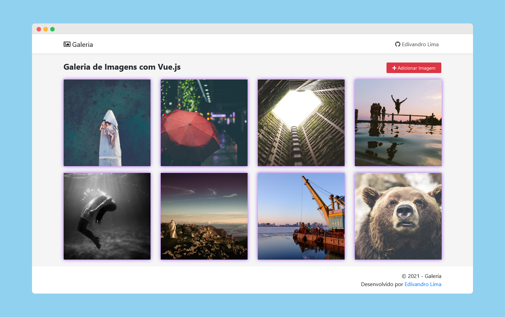

# Galeria de imagens com Vue.js
Projeto para estudo e prática do framework Vue.js.

Demonstração do projeto online: [Clique aqui](http://galeria-vuejs.epizy.com/)

## Dependências
- VueRouter
- Vuex
- VueMeta
- Animate.css
- Bootstrap
- Fortawesome

### Instalando dependências 
``` $ npm install ```

### Levantando server com reload em localhost:8080
``` $ npm run serve ```

### Build para produção com minificação
``` $ npm run build ```

### Preview

